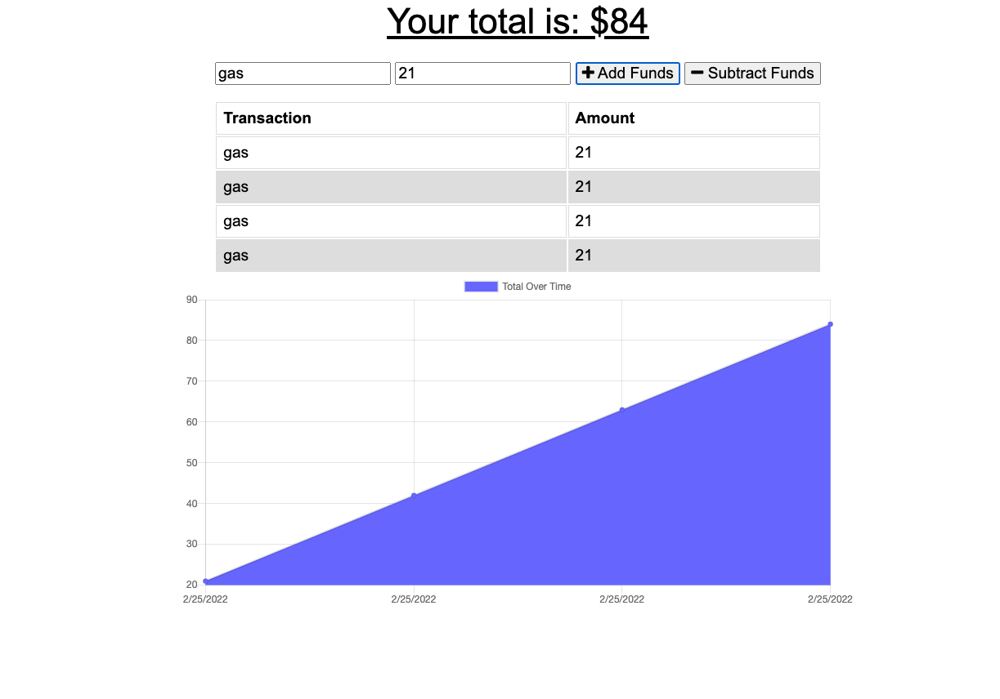

# budget-tracker
  
## Description

This is a progressive web application that allows users to track their expenses. It utilizes plain javascript for the front end, and express/mongodb for the back end.

## Table of Contents

* [Installation](#installation)
 
 
 
 * [Questions](#questions)

## Installation Instructions

clone the repository, npm install, then npm start.

## License

This application is licensed under MIT

## Questions

If you have any questions, email me at amalagon251@gmail.com

Github: github.com/amalagon1

